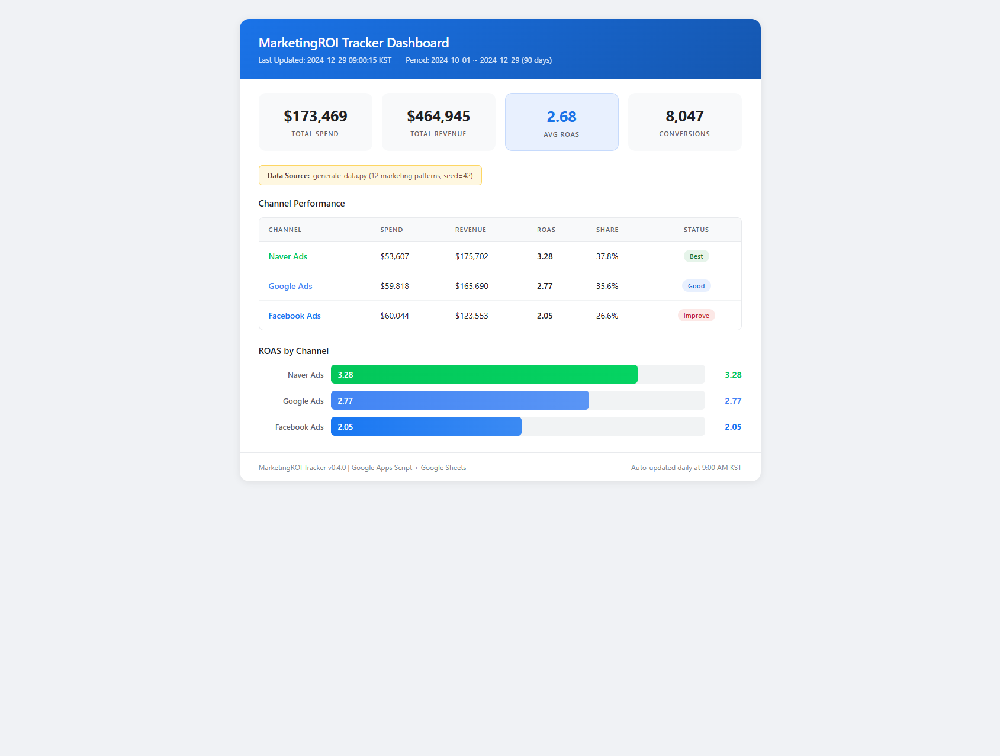

# 마케팅 ROI 최적화 분석

> 3채널 디지털 광고(Google Ads, Facebook Ads, Naver Ads) 90일 데이터를 분석하여,
> **ROAS 가중 예산 재배분으로 동일 예산 대비 +4.3% 매출 증가**가 가능함을 검증한 프로젝트

## 핵심 질문

중소 이커머스 기업이 월 ₩7,500만을 3개 채널에 집행하고 있으나, **채널별 실제 수익 기여도**와 **최적 예산 배분**에 대한 데이터 기반 근거가 부재합니다. 이 프로젝트는 세 가지 의사결정 질문에 데이터로 답합니다:

| # | 질문 | 분석 방법 | 결론 |
|---|------|----------|------|
| Q1 | 채널별 ROAS 차이가 통계적으로 유의미한가? | One-Way ANOVA | **유의 (F=229.5, p < 0.001)** — Naver(3.28) > Google(2.77) > Facebook(2.05) |
| Q2 | 광고비를 늘리면 매출도 비례해서 늘어나는가? | 로그 vs 선형 회귀 R² + 5-Fold CV | **비례하지 않음** — 체감수익(Diminishing Returns) 확인 |
| Q3 | 동일 예산으로 매출을 더 올릴 수 있는가? | ROAS 가중 예산 시뮬레이션 | **가능** — 재배분만으로 +4.3% (약 ₩2,600만) 증가 |

## 분석 프레임워크

```
문제 정의: "3채널 예산 배분이 최적인가?"
    │
    ├─ Q1. 채널 효율 차이 검증
    │   ├─ EDA: 채널별 ROAS 분포 탐색 → 시각적 격차 확인
    │   ├─ 가설: "3채널 ROAS 평균은 동일하다" (H₀)
    │   ├─ 검정: One-Way ANOVA → F=229.5, p<0.001 → H₀ 기각
    │   └─ 결론: 채널 간 ROAS 차이는 통계적으로 유의
    │
    ├─ Q2. 체감수익 구조 확인
    │   ├─ 가설: "광고비↑ = 매출 비례↑" (선형 관계)
    │   ├─ 검정: 선형/로그/다항 3모델 R² 비교 + 5-Fold 교차검증
    │   ├─ 결과: 로그/다항식 모델이 선형보다 우세 (CV R² 기준)
    │   ├─ 잔차: Shapiro-Wilk 정규성 충족, Durbin-Watson 자기상관 존재
    │   └─ 결론: 단일 채널 과잉투자보다 다채널 분산이 유리
    │
    ├─ Q3. 최적 예산 배분 도출
    │   ├─ 방법: ROAS 가중치 기반 재배분 시뮬레이션
    │   ├─ 결과: Naver 31%→40%, Facebook 35%→25%, Google 유지
    │   ├─ 효과: 동일 예산 대비 +4.3% 매출 증가
    │   └─ 교차 검증: SQL(Supabase)에서 독립 계산 → +4.4%로 일치
    │
    └─ 추가 분석
        ├─ 멀티터치 어트리뷰션: 5모델 비교 → 모델 선택이 매출 귀속 최대 30% 변동
        ├─ 퍼널 분석: Facebook은 CTR 병목, Naver는 CVR 병목
        └─ ARIMA 예측: 30일 ROAS 예측 + 95% 신뢰구간
```

## 주요 발견

| # | 발견 | 근거 | 실행 제안 |
|---|------|------|----------|
| 1 | **Naver Ads ROAS 3.28로 최고 효율** | ANOVA p<0.001, CPA $3.98 최저 | 예산 30.9% → 40.4% 증액 |
| 2 | **전 채널 체감수익 확인** | 로그 R² > 선형 R², 5-Fold CV 검증 | 다채널 분산 투자 전략 |
| 3 | **Brand 캠페인이 전 채널 ROAS 1위** | ROAS 3.5~4.0, RANK() OVER 9개 캠페인 비교 | Brand 키워드 방어 예산 우선 확보 |
| 4 | **어트리뷰션 모델별 매출 귀속 최대 30% 차이** | 5모델(Last/First/Linear/Decay/Position) 비교 | 복수 모델 교차 검증 도입 |
| 5 | **블랙프라이데이 전 채널 ROAS 2~3배 급등** | Z-score 이상치 14건 탐지 (|Z|>2) | 시즌 이벤트 사전 예산 확보 |
| 6 | **A/B 테스트(n=8) 검정력 부족 → 실험 설계 한계 진단** | ITT + Power Analysis, MDE 산출 | 최소 28일 테스트 + 사전 Power Analysis 필수 |
| 7 | **시나리오 분석: Conservative에서도 하방 리스크 제한적** | 3시나리오 시뮬레이션 + Guard Rail 설정 | ROAS 하한 자동 모니터링 체계 구축 |

> 상세 분석: [`analysis/report/executive_summary.md`](./analysis/report/executive_summary.md)
> 실행 로드맵: [`analysis/report/action_roadmap.md`](./analysis/report/action_roadmap.md)

### 통계적으로 확인되지 않은 패턴

| 패턴 | 관찰 | 검정 결과 | 향후 과제 |
|------|------|----------|----------|
| 주중/주말 ROAS 차이 | 히트맵에서 요일별 차이 관찰 | t-test 3채널 모두 p > 0.05 (비유의) | 180일+ 데이터 축적 후 재검증 |
| Day-parting 효과 | 시간대별 패턴 가능성 | 시간별 데이터 미보유 | GA4 시간별 데이터 연동 필요 |

## Interactive Dashboard

| 대시보드 | 링크 |
|----------|------|
| **Chart.js** (필터링 + PNG/PDF Export) | [Live Demo](https://dashboard-kappa-self-57.vercel.app) |
| **Tableau Public** | [Dashboard](https://public.tableau.com/views/MarketingROI/Dashboard1) |



## 분석 노트북 (3개)

> GitHub에서 렌더링이 느리면 nbviewer로 확인하세요.

| 노트북 | nbviewer |
|--------|----------|
| 기본 분석 | [](https://nbviewer.org/github/Taek-D/marketing-roi-tracker/blob/master/analysis/MarketingROI_Analysis.ipynb) |
| 고급 분석 | [](https://nbviewer.org/github/Taek-D/marketing-roi-tracker/blob/master/analysis/MarketingROI_Advanced_Analysis.ipynb) |
| SQL 분석 | [](https://nbviewer.org/github/Taek-D/marketing-roi-tracker/blob/master/analysis/MarketingROI_SQL_Analysis.ipynb) |

### 기본 분석 — [`MarketingROI_Analysis.ipynb`](./analysis/MarketingROI_Analysis.ipynb)

> 가설 주도형 분석: EDA → 통계 검정 → 회귀 모델링 → 예산 최적화 → 시나리오 분석

| 단계 | 질문 | 방법 | 핵심 결과 |
|------|------|------|----------|
| EDA | 채널/캠페인별 효율 차이가 있는가? | Grouped Bar, Bubble Chart, Heatmap | Naver > Google > Facebook, Brand > Retargeting > Generic |
| 통계 검정 | 채널 간 차이가 우연인가? | ANOVA, 독립표본 t-test | 채널 간 유의 (p<0.001), 주중/주말 비유의 (p>0.05) |
| 회귀 분석 | 광고비-매출 관계의 형태는? | 선형/로그/다항 R² + 5-Fold CV + 잔차 분석 | 체감수익 구조, 잔차 정규성 충족 |
| 최적화 | 최적 예산 배분은? | ROAS 가중 시뮬레이션 | +4.3% 매출 증가 (약 ₩2,600만) |
| 시나리오 | 나빠지면 어떻게 되는가? | Conservative/Base/Optimistic + Guard Rail | 하방 리스크 제한적, 자동 방어 기준 설정 |
| 이상치 | 비정상 성과는 언제? | Z-score (|Z|>2) | 14건 탐지 (BF 급등, FB 추적 장애 급락) |

### 고급 분석 — [`MarketingROI_Advanced_Analysis.ipynb`](./analysis/MarketingROI_Advanced_Analysis.ipynb)

> 기본 분석의 한계를 보완: "Last-Touch만으로 충분한가?", "퍼널 어디가 병목인가?", "향후 추세는?"

| 분석 | 기본 분석의 한계 | 고급 분석의 답 |
|------|----------------|---------------|
| 멀티터치 어트리뷰션 5모델 | Last-Touch 의존 → 채널 기여 왜곡 | 모델 선택이 예산 배분을 최대 30% 변동시킴 |
| 마케팅 퍼널 분석 | "왜 차이나는가?" 미답변 | Facebook은 CTR 병목 (3.94%), Naver는 CVR 개선 여지 |
| ARIMA 시계열 예측 | 과거 해석만 수행 | ADF 정상성 확인 → ARIMA(2,1,2) 30일 예측 + 95% 신뢰구간 |
| **A/B 테스트 분석** | 소재 변경 효과 미검증 | **n=8 검정력 부족 진단 → Power Analysis로 최소 28일 필요 산출** |

### SQL 분석 — [`MarketingROI_SQL_Analysis.ipynb`](./analysis/MarketingROI_SQL_Analysis.ipynb)

> Supabase PostgreSQL에서 고급 SQL로 Python 분석 결과를 독립적으로 교차 검증

| SQL 기법 | 분석 | Python 분석과의 교차 검증 |
|----------|------|--------------------------|
| `GROUP BY` + 집계 함수 | 채널별 KPI 요약 | ROAS 순위 일치 (Naver > Google > FB) |
| `AVG() OVER (ROWS BETWEEN)` | 7일 이동평균 | pandas rolling과 동일 결과 |
| `RANK() OVER (PARTITION BY)` | 캠페인 랭킹 | Naver_Brand 전체 1위 일치 |
| CTE + `STDDEV() OVER` | Z-score 이상치 | 14건 동일 탐지 |
| 다단계 CTE + `CROSS JOIN` | 예산 시뮬레이션 | +4.4% (Python +4.3%와 일치) |

## 분석의 한계와 향후 과제

| 한계 | 영향 | 보완 방법 |
|------|------|----------|
| **시뮬레이션 데이터** | 12가지 실무 패턴을 반영했으나 실제 마케팅 데이터의 복잡성에 미달 | 실 데이터 적용 시 모델 재학습 필요 |
| **주중/주말 효과 비유의** | t-test 3채널 모두 p > 0.05로 통계적 확인 실패 | 검정력 분석(Power Analysis) + 샘플 확대 |
| **단일 접점 퍼널** | 크로스디바이스·오프라인 전환 미반영 | GA4 + CRM 데이터 연동 |
| **외부 변수 미반영** | 경쟁사 활동, 거시경제 미포함 | SARIMAX 외생변수 모델 확장 |
| **고정 ROAS 가중치** | 시간에 따른 채널 효율 변동 미반영 | Rolling Window 기반 동적 최적화 |

## 자동화 시스템

분석 인사이트를 운영에 반영하기 위한 **Google Apps Script 자동화**를 포함합니다:

- **자동 데이터 수집**: 매일 9시(KST) 3채널 API → Google Sheets 적재
- **Multi-Touch 어트리뷰션**: 5모델 자동 계산 (Attribution.gs)
- **Z-score 이상치 탐지**: ROAS 이상 시 Slack 즉시 알림 (Report.gs)
- **주간 리포트**: WoW 비교 성과 자동 발송 (Report.gs)
- **단위 테스트**: 핵심 비즈니스 로직 30개 테스트 (Tests.gs)
- **CI/CD**: GitHub Actions 구문 검사 + 시크릿 스캔

## Tech Stack

| 영역 | 기술 |
|------|------|
| 데이터 분석 | Python (pandas, scipy, statsmodels, scikit-learn) |
| SQL | Supabase PostgreSQL (Window Function, CTE, Z-score) |
| 시각화 | matplotlib, seaborn, Chart.js, Tableau Public |
| 자동화 | Google Apps Script (ES6), clasp |
| API | Google Ads API v18, Facebook Marketing API v21, Naver Search Ads API |
| 배포 | Vercel (대시보드), GitHub Actions (CI) |

## Project Structure

```
marketing-roi-tracker/
├── automation/                 # GAS 자동화 코드 (clasp rootDir)
│   ├── Code.gs                 # 메인 로직 (API 호출, 데이터 수집, Slack 알림)
│   ├── Config.gs               # 전역 설정 (CONFIG 객체, getProperty, log)
│   ├── Attribution.gs          # Multi-Touch 애트리뷰션 (5모델) + 퍼널 분석
│   ├── Report.gs               # 이상치 탐지 (Z-score) + 주간 자동 리포트
│   ├── Setup.gs                # 초기 설정 (시트 생성, 테스트 데이터, 트리거)
│   ├── Tests.gs                # 단위 테스트 (30개 테스트 케이스)
│   ├── appsscript.json         # Apps Script 매니페스트
│   ├── auth_setup_instructions.md  # Google/Facebook 인증 가이드
│   └── naver_setup_guide.md    # 네이버 검색광고 API 연동 가이드
│
├── analysis/                   # 마케팅 ROI 심층 분석
│   ├── MarketingROI_Analysis.ipynb           # 기본 분석 (EDA, 통계검정, 회귀, 최적화)
│   ├── MarketingROI_Advanced_Analysis.ipynb  # 고급 분석 (애트리뷰션, 퍼널, 예측)
│   ├── MarketingROI_SQL_Analysis.ipynb       # SQL 분석 (8개 쿼리, Supabase)
│   ├── generate_data.py                      # 실무급 시뮬레이션 데이터 생성기
│   ├── export_for_tableau.py                 # Tableau용 CSV Export
│   ├── requirements.txt                      # Python 의존성
│   ├── TABLEAU_GUIDE.md                      # Tableau Public 배포 가이드
│   ├── data/
│   │   ├── marketing_raw_data.csv            # 90일 x 3채널 x 3캠페인 (810행)
│   │   ├── tableau_summary.csv               # 채널별 집계
│   │   ├── tableau_daily.csv                 # 일별 트렌드
│   │   └── tableau_campaign.csv              # 캠페인 상세
│   ├── charts/                               # 분석 차트 (PNG 15개)
│   └── report/
│       ├── executive_summary.md              # 경영진 보고서
│       └── action_roadmap.md                 # 통합 실행 로드맵
│
├── dashboard/                  # 인터랙티브 대시보드
│   └── index.html              # Chart.js 기반 (Vercel 배포)
│
├── docs/screenshots/
│   └── dashboard_preview.png
│
├── .github/workflows/
│   └── validate.yml            # CI: 구문 검사 + 시크릿 스캔
│
├── README.md
├── CLAUDE.md                   # 개발 규칙
├── PRD.md                      # 제품 요구사항 문서
└── CHANGELOG.md                # 버전 히스토리
```

## Quick Start

### 1. 저장소 클론

```bash
git clone https://github.com/Taek-D/marketing-roi-tracker.git
cd marketing-roi-tracker
```

### 2. 분석 노트북 실행

```bash
cd analysis
pip install -r requirements.txt
python generate_data.py
jupyter notebook
```

### 3. GAS 자동화 배포 (선택)

```bash
npm install -g @google/clasp
clasp login
clasp create --title "MarketingROI Tracker" --type sheets
clasp push    # .clasp.json의 rootDir: "automation" 기준으로 push
```

Apps Script 에디터에서 `setupAll` 실행 → 시트 4개 생성 + 테스트 데이터 + 트리거 설정 완료

> API 인증 가이드: [auth_setup_instructions.md](./automation/auth_setup_instructions.md) | [naver_setup_guide.md](./automation/naver_setup_guide.md)

## License

MIT License.
