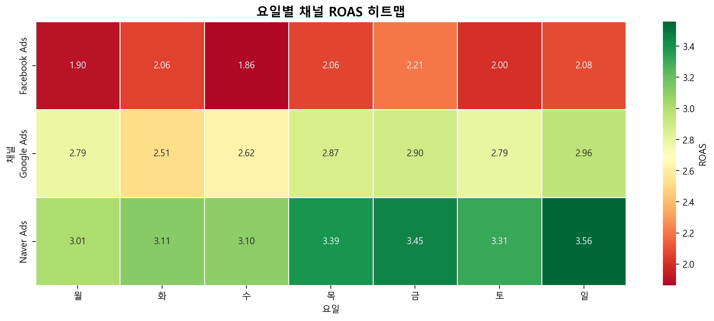
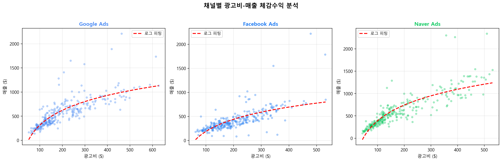
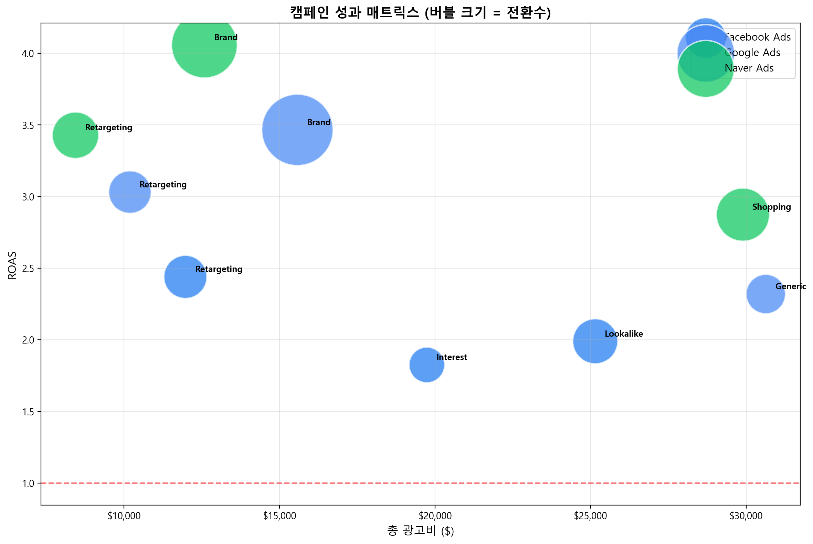
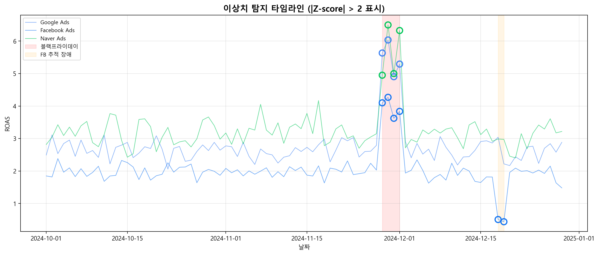
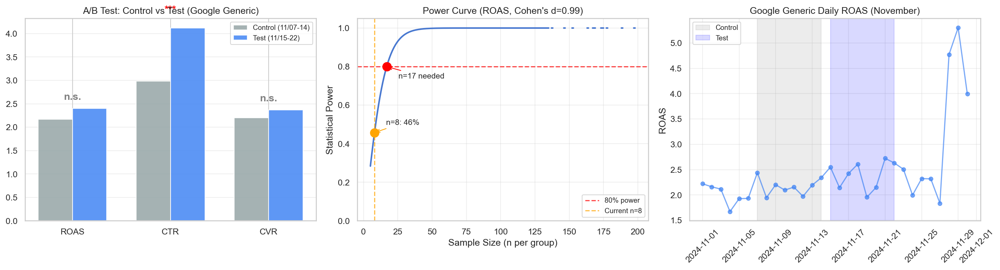
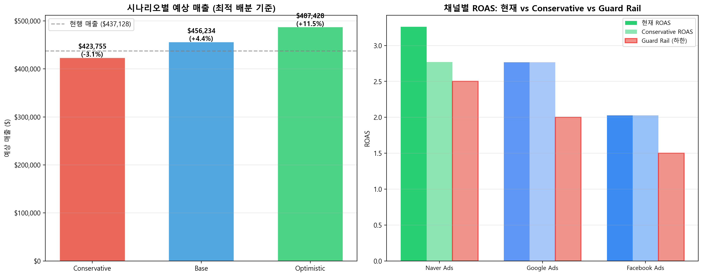
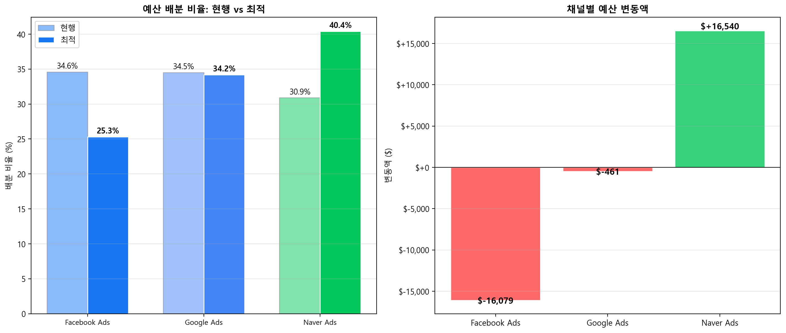

# 마케팅 ROI 분석 - 경영진 보고서

> **분석 기간**: 2024-10-01 ~ 2024-12-29 (90일)
> **채널**: Google Ads, Facebook Ads, Naver Ads (9개 캠페인)
> **작성일**: 2025-01
> **통화**: KRW (₩), 환율 1 USD = 1,300 KRW 적용

---

## 1. 핵심 지표 요약

| 지표 | 수치 |
|------|------|
| 총 광고비 | ₩2억 2,551만 |
| 총 매출 | ₩6억 443만 |
| 전체 ROAS | 2.68 |
| 총 전환수 | 8,000+ |

### 채널별 ROAS 비교

| 채널 | 광고비 | 매출 | ROAS | 평가 |
|------|--------|------|------|------|
| **Naver Ads** | ₩6,969만 (30.9%) | ₩2억 2,841만 | **3.28** | 최고 효율 |
| **Google Ads** | ₩7,776만 (34.5%) | ₩2억 1,540만 | **2.77** | 양호 |
| **Facebook Ads** | ₩7,806만 (34.6%) | ₩1억 6,062만 | **2.05** | 개선 필요 |

> Naver Ads가 가장 낮은 광고비로 가장 높은 매출을 달성 (ROAS 3.28)

---

## 2. 핵심 발견 7가지

### 발견 1: 네이버 광고 효율성 우위
- Naver Ads ROAS(3.28)가 Google(2.77), Facebook(2.05) 대비 현저히 높음
- ANOVA 검정 결과 채널 간 차이 **통계적으로 매우 유의** (p<0.001)
- 특히 Naver Brand 캠페인이 ROAS 4.0으로 전체 최고 성과

### 발견 2: 요일별 성과 패턴 (탐색적 발견)
- **Google/Naver**: 히트맵 상 주중 ROAS가 주말 대비 소폭 높은 경향 관찰
- **Facebook**: 주말 ROAS가 주중 대비 소폭 높은 경향 관찰
- **단, t-test 결과 3개 채널 모두 주중/주말 차이 통계적으로 비유의** (Google p=0.28, Facebook p=0.87, Naver p=0.06)
- 현재 데이터 규모(90일)에서는 캠페인 내 변동성이 커 요일 효과가 검출되지 않음

### 발견 3: 광고비 체감수익 (Diminishing Returns)
- 전 채널에서 광고비 증가 시 한계 ROAS 감소 확인
- 로그 회귀 모델이 선형 모델보다 높은 설명력 (R²)
- 예산 무한 증액이 아닌 **최적 지점** 존재

### 발견 4: 캠페인 유형별 성과 차이
- **Brand 캠페인**: 전 채널 최고 ROAS (3.5~4.0)
- **Retargeting 캠페인**: 중간 효율 (2.5~3.5)
- **Generic/Interest 캠페인**: 최저 효율 (1.8~2.2)

### 발견 5: 이상치 이벤트 분석
- **블랙프라이데이 (11/28~12/1)**: 전 채널 ROAS 급등 (Z-score 3~5), 시즌 마케팅 효과 확인
- **Facebook 추적 장애 (12/18~19)**: 전환 데이터 80% 누락, ROAS 0.5 이하로 급락
- 14건의 이상치 탐지 (Z-score > 2 기준)

### 발견 6: A/B 테스트 실험 설계의 한계 진단
- Google Generic 캠페인 소재 변경 A/B 테스트 (11/15~22) 분석
- **n=8/그룹 → 검정력 45.7%** (목표 80% 미달), 유의미한 효과 검출 불가
- MDE(최소 검출 효과) = 0.98σ → 최소 **n=17/그룹** 확보 필요
- 사전 검정력 분석(Power Analysis) 없이 실험 시 자원 낭비 위험

### 발견 7: 3-시나리오 분석으로 하방 리스크 정량화
- **Conservative** (네이버 경쟁 과열): 매출 -3.1% → 하방 리스크 제한적
- **Base** (현행 ROAS 유지 + 재배분): 매출 +4.3%
- **Optimistic** (Facebook CVR 개선 + 시즌 효과): 매출 +11.8%
- 확률 가중 **기대값: +4.8%** (약 ₩2,900만 추가 매출)
- Guard Rail 기반 자동 방어 체계 제안 (ROAS 하한, CPA 상한, 일 예산 한도)

---

## 3. 예산 최적화 제안

### 현행 vs 최적 예산 배분

| 채널 | 현행 비율 | 최적 비율 | 변동액 |
|------|:---------:|:---------:|-------:|
| Naver Ads | 30.9% | **40.4%** | +₩2,150만 |
| Google Ads | 34.5% | **34.2%** | -₩60만 |
| Facebook Ads | 34.6% | **25.3%** | -₩2,090만 |

### 예상 효과
- **총 예산 동일** 유지 (₩2억 2,551만)
- **예상 매출**: ₩6억 443만 → **₩6억 3,030만** (+4.3%)
- ROAS 비중 기반 재배분만으로 약 **₩2,600만 추가 매출** 가능

---

## 4. 실행 제안 (Action Items)

### 즉시 실행 (1주 내)
| 우선순위 | 항목 | 예상 효과 |
|----------|------|-----------|
| 높음 | 네이버 Brand 캠페인 예산 30% 증액 | ROAS 3.5+ 구간 매출 확대 |
| 높음 | ROAS 가중 예산 재배분 (Naver↑, Facebook↓) | 동일 예산 대비 +4.3% 매출 증가 |

### 단기 실행 (2주 내)
| 우선순위 | 항목 | 예상 효과 |
|----------|------|-----------|
| 중간 | Facebook CAPI 서버사이드 추적 도입 | 추적 누락 방지, 데이터 정확성 향상 |
| 중간 | Google Generic 캠페인 타겟팅 정교화 | ROAS 2.2 → 2.5 목표 |

### 중기 실행 (1개월 내)
| 우선순위 | 항목 | 예상 효과 |
|----------|------|-----------|
| 낮음 | 채널별 체감수익 기반 예산 상한선 설정 | 예산 낭비 방지 |
| 낮음 | 블랙프라이데이 대비 사전 예산 계획 수립 | 시즌 매출 극대화 |

---

## 5. 분석 방법론

| 분석 | 방법 | 도구 |
|------|------|------|
| 채널 비교 | Grouped Bar Chart, ROAS 산출 | pandas, matplotlib |
| 트렌드 분석 | 7일 이동평균, 시계열 시각화 | pandas rolling |
| 요일 효과 | 히트맵, 독립표본 t-test | seaborn, scipy.stats |
| 채널 차이 | One-Way ANOVA | scipy.stats |
| 체감수익 | 로그 회귀 피팅 | numpy, sklearn |
| 모델 비교 | 선형/로그/다항식 R² 비교 | sklearn |
| 예산 최적화 | ROAS 가중 재배분 | pandas |
| 이상치 탐지 | Z-score (|Z|>2) | scipy.stats |
| 멀티터치 어트리뷰션 | 5모델 비교 (Last/First/Linear/Decay/Position) | pandas |
| 퍼널 분석 | CTR/CVR/CPA 병목 진단 | pandas |
| 시계열 예측 | ADF 검정 + ARIMA(2,1,2) | statsmodels |
| A/B 테스트 | ITT 원칙, Welch's t-test, Power Analysis | scipy, statsmodels |
| 시나리오 분석 | 3-시나리오 (Conservative/Base/Optimistic) + Guard Rail | pandas |

---

## 6. 차트 목록

| # | 차트 | 파일 |
|---|------|------|
| 1 | 채널별 광고비-매출 비교 | `charts/01_channel_cost_revenue.png` |
| 2 | 일별 ROAS 추이 (7일 이동평균) | `charts/02_daily_roas_trend.png` |
| 3 | 캠페인 성과 매트릭스 | `charts/03_campaign_matrix.png` |
| 4 | 요일별 채널 성과 히트맵 | `charts/04_weekday_heatmap.png` |
| 5 | 광고비-매출 체감수익 | `charts/05_diminishing_returns.png` |
| 6 | 통계 검정 결과 | `charts/06_statistical_tests.png` |
| 7 | 회귀 모델 비교 | `charts/07_regression_comparison.png` |
| 8 | 현행 vs 최적 예산 배분 | `charts/08_budget_optimization.png` |
| 9 | 한계 ROAS 곡선 | `charts/09_marginal_roas.png` |
| 10 | 이상치 탐지 타임라인 | `charts/10_outlier_detection.png` |
| 11 | 어트리뷰션 모델 비교 | `charts/11_attribution_model_comparison.png` |
| 12 | 마케팅 퍼널 분석 | `charts/12_funnel_analysis.png` |
| 13 | ROAS 시계열 예측 | `charts/13_roas_forecast.png` |
| 14 | A/B 테스트 분석 | `charts/14_ab_test_analysis.png` |
| 15 | 예산 시나리오 분석 | `charts/15_scenario_analysis.png` |

---

*본 보고서는 `MarketingROI_Analysis.ipynb` 및 `MarketingROI_Advanced_Analysis.ipynb` 노트북의 분석 결과를 기반으로 작성되었습니다.*
